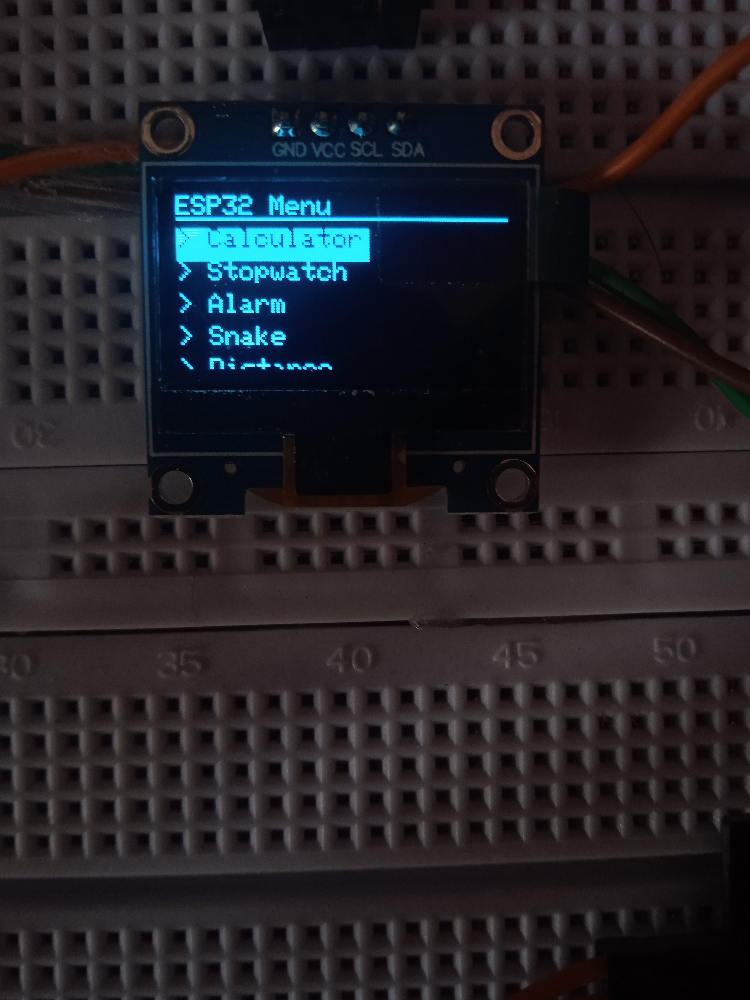
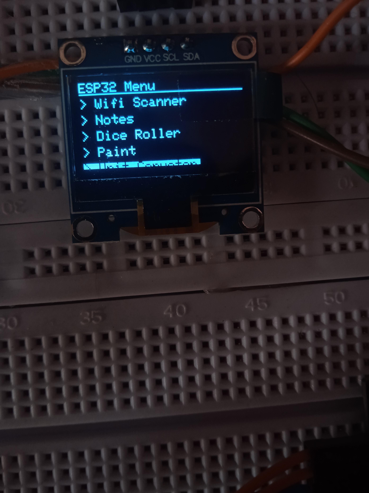
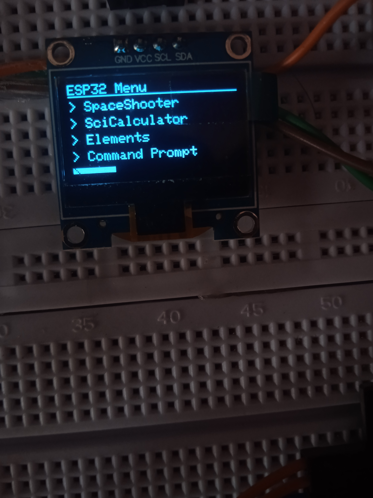

# Esp32 Pocket Computer with OLED Display

Pocket computer with 20+ apps calculator sci-calculator, paint, pong, space shooter, snake, command prompt, notes, distance, temperature, alarm etc.

---

## 📸 Project Screenshots

# Esp32-Pocket-Computer-for-I2C-oled-display
Pocket computer with 20+apps calculator sci-calculator ms paint pong space shooter snake command prompt notes distance temperature alarm sunlightalarm  elements etc.
